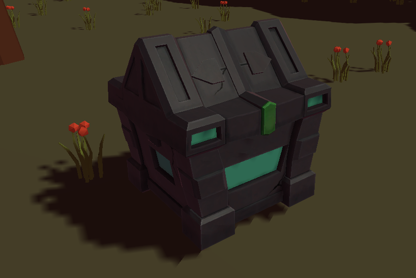

# Game Design Document (GDD)

## Table of contents
* [Game Overview](#game-overview)
* [Story and Narrative](#story-and-narrative)
* [Gameplay and Mechanics](#gameplay-and-mechanics)
* [Levels and World Design](#levels-and-world-design)
* [Art and Audio](#art-and-audio)
* [User Interface (UI)](#user-interface)
* [Technology and Tools](#technology-and-tools)
* [Team Communication, Timelines, and Task Assignment](#team-communication--timelines--and-task-assignment)
* [Possible Challenges](#possible-challenges)
* [References](#references)

## Game Overview
“Dirge of the Wolf” is a real-time strategy and survival game that incorporates time and resource management and the control of unique combat mechanics within a tainted world. By playing as the wolf king, the player needs to defeat scattered soul-eating enemies and gather the souls of the fallen wolf spirits. With strategic skills and utilization of resources from the surroundings, the king will ultimately boost their strength, defeat the boss of the land, and seize their territory.

The primary objective of the player is to gather as many fallen souls as possible and maximise resources within a short period of time, and finally, capture the land by defeating specific bosses within 5 minutes in different regions.

The core emotional concept revolves around evoking a sense of a world-saving mission and a thrilling race against time. As the player embarks on the journey of exploration and conquer of land, the player will progressively grow in not only their manpower but also skills that will support the player to become more skillful in the later stages of the game.

> _Game idea reference_

   
   

   

This game draws inspiration from **_Monster Hunter_** and **_Feed and Grow: Fish_**. In Monster Hunter, players hunt and battle large monsters in an action role-playing setting; while Feed and Grow: Fish is an aquatic survival game where players start as a small fish and evolve by consuming other creatures. Unlike these two games, in our game, players won't use in-game currency to buy equipment or evolve; instead, they will rally wolves under the Wolf King to enhance survivability.

This game is primarily targeted towards adolescents and young adults ranging from 15-30 years old, both male and female, and is most applicable for players who enjoy strategic and battling games. The mechanics for the game are designed so that both novice and experienced players can gain rewarding gameplay experiences.
### Unique Selling Points (USPs)
* Players are able to select different skills, as well as modify their manpower
* The player will be able to gain an experience from the wolf king’s perspective, having a wild field vision of the surrounding environment

## Story and Narrative
Deep within the heart of a land, an unforeseen darkness is unfolding. Soul-eating enemies crept into the land from the shadows, turning the once-vibrant habitat into a land of silence and despair. Creatures that had once danced under the canopy now lay motionless, their spirits devoured by these invaders.

Hidden in the darkness, the Wolf King, the last of his dignity still stands. He possesses a special power that enables him to awaken and utilize the souls of his fallen kind. With every enemy he defeats, echoes of lost wolves would swirl around him.

Suddenly, an ominous chill lingered in the air. The Wolf King felt it in his bones — an even darker presence was approaching, a wickered overlord casting a shadow even more threatening than the soul-eaters. 
The responsibility fell upon the player to guide the Wolf King on his journey. Gathering the fractured souls, fighting off the relentless tide of monsters, and preparing for the confrontation with the overlord, all for the purpose of reclaiming and restoring the sanctity of the forest.
### Main Characters:
* **Player Character:** The Player will take on the role of the Wolf King, a powerful wolf. Their tasks involve guiding the wolf spirits, expanding their territory, using the power of spirits in hunting, addressing threats from other large creatures, and ensuring its own survival and the glory of the wolves.
> _Wolf_

   

* **Wolf spirits:** Wolf king's own kind and mate. They are invincible and pose a threat to any boss they face when the wolf summons its skills
  * These spirits will take the form of a wolf head, however, will be in a transparent kind
  * They will not attack any normal enemies.
  * There are 3 different coloured spirits, by defeating soul-eating enemies, player randomly saves a coloured spirit. (see skill details in Gameplay and Mechanics sections)
    * Red: can be used for skill Golden Stun Spire
    * Blue: can be used for skill Inferno Missiles
    * Green: can be used for skill Leaf Lifeline
  * After using their skills, they will need some time to recover until their skill can be used again
> _Wolf Spirit_

   

* **Soul-eating enemies:** Creatures that consumed the souls of the fallen wolves. By defeating them, souls will be released and they will become great teammates of the wolf king.
> _Soul-eating enemies example_

   
   
  

* **Large Dominant Creatures:** Overlords of certain territories pose significant threats to the wolf pack. These creatures emerge within the wilderness, striving to take over the wolves' habitat. The primary objective of the game is to defeat them and seize their territories.
> _Boss creatures example_

   
   
   

## Gameplay and Mechanics
* Player Perspective:
  * The game adopts a _dynamic angle third-person_ perspective, similar to MOBA games like "League of Legends", allowing players to observe the environment and the actions of the Wolf King. The camera can be rotated within a certain range, providing players with a better field of view. The player character, player status, enemy status as well as icons representing the wolf pack skills will be displayed on the screen, showcasing the majestic and powerful image of a wolf.
> _Player perspective_

   

* Controls:
  * The controls are intuitive and user-friendly. Players control the movement of the Wolf King using the keyboard keys **W, A, S, and D**. Other keyboard keys such as **E, R, F, Shift and Space** allow the Wolf King to perform various actions, such as sprinting, dodging, and using different skills.
  * Pressing **esc** pauses the game
  * The **left mouse button** can be used to interact with objects in the environment or perform basic attacks
  * Players can **move the mouse** to adjust the camera, obtaining a comprehensive view of the surroundings.
> _Game controll_

  

* Interaction with the Game World:
  * Players interact with the game world by exploring, hunting, and engaging in combat. They can guide the wolf spirits to initiate hunts using their skills, battle other creatures, and interact with objects in the environment. Player choices in terms of time and resource management, and combat strategies influence the survival outcome of the wolf.
* Story Progression:
  * Players will start by themselves with 3 main orbiting spirits, assuming the role of the Wolf King. At the beginning of the game, players will need to explore the surrounding environment to gather _wolf spirits_ through continuous hunting and to increase manpower. As the pack grows, the overall attributes will stack up as the player will be able to use the powers of the spirits on bosses as the number grows, laying the groundwork for the battle that's coming up.
  * When the wolf king's health reaches zero, or if the wolf king does not take over the territory within the 5-minute countdown, the game will result in a failure. Otherwise, if the wolf king survives and defeats the boss, the player will be able to proceed to the next level.
> _Defeat page_

  

### The core gameplay mechanics encompass:
* Hunting and Gathering:
  * Players can initiate hunts for various prey, using strategies to corner and capture the enemy while avoiding harm.
* Combat:
  * Combat mechanics involve dodging, healing, and different types of attacking, demanding precise timing and tactics to defeat stronger opponents.
* Skills:
  * The player will need to gather enough wolf spirits to use any skill. The Wolf King can utilize skills for combat or healing.
  * These skills can only be used when facing the boss.
  * After a skill is used, there will be a specific CD time until the skill can be used again.
  * Each skill will have different animation and sound effects
    * Skill 1: Inferno Missiles - Fires blue missiles at the boss from far away (CD time: 20 seconds)
    * Skill 2: Leaf Lifeline - Revitalizes the body and mend wounds (CD time: 20 seconds)
    * Skill 3: Golden Stun Spire - Shoot a burst of energy, target hit is left dazed (no CD)
> _Skills_

  

* Pack Dynamics:
  * Players can leverage the spirits' abilities in battles, utilizing skills to coordinate attacks for maximum impact.
* Survival Strategy:
  * The player needs to adapt to constantly changing environments and manage time and resources for survival.

### The time survival mechanic: 
The mechanic aligns with the gradual increase in challenges and the wolf king's growth over time. At the beginning of the game, the player will be told that they have to gather the fallen spirits by defeating soul-eating enemies. As the player invests time in exploring, hunting, and combat, the number of souls will gradually increase. Players will be _notified_ when the boss arrives.

Before the **five-minute** countdown finishes, The player will need to stay alive and defeat the overlord of the land in order to complete the region and proceed to the next map. It is the player’s strategic choices that determine the fate of the wolf king in the wilderness.
> _Timer mechanic_

  

## Levels and World Design
* The game will be in the form of **3D**, with a fixed single screen.
* The player will be able to rotate the camera by moving the mouse, but the camera will always be centered on the wolf king and the player will constantly have a view of their surroundings.
* There are 3 levels _(see game idea reference in Art and Audio section)_, The player can only proceed to the next region after they defeated the boss in the previous region:
  * Grassland: The first map with no special attributes.
  * Desert: Reduces chests and stronger enemies.
  * Snowfield: Reduces enemy spawns (meaning fewer spirits can be saved).
* There won't be a minimap as it is the player's mission to explore the area and recruit its dead kinds 
* The world will have some basic vegetation, including trees, rocks, lakes, and grass. Players can use these objects to help them round up their prey.
* The only objects that the player is able to interact with are the soul-eating enemies, bosses, and treasure chests containing buffs.
* There are currently 4 types of chests:  
  * Health chest: Increase health by 500
  * :dagger:Attack chest (buff): Doubles own damage for 10 seconds
  * :shield:Defence chest (buff): Halves enemies' damage for 20 seconds
  * :crossed_swords:Invincible chest (buff): Enemies will not endure any harm for 10 seconds
> _Health Chest Example_

  

### Physics:
* Physics includes simple object collision. Objects such as rocks, trees, chests, and different characters cannot pass through each other
* Different enemies have their own activity ranges. Their direction of movement will depend on where the player is.
* Attacks between animals are determined through collision testing, meaning that playing the animation and making contact counts as an attack. (Movement is disabled during attacks)

## Art and Audio
The overall style will be a combination of low poly style, and different color main tones will be set according to different level maps. Our maps include grassland:deciduous_tree::deciduous_tree:, swamp:spider_web::worm:, desert:dromedary_camel::desert: and snow field:snowflake::mountain_snow:. 

* In the grassland of the first level, green is taken as the main color of the environment, and the overall aesthetic should be gloomy and consistent. At the same time, it can also add light:high_brightness:, fog:fog:, halo, etc., to create an atmosphere effect.

    

    

* In the second level of the desert, mainly yellow and brown.

    

* The snowfield of the third level is mainly white, and additional snow effects should be added, such as snowflakes, and sound effects should also be increased to simulate real envireonment.

    

Depending on the scene, we will set different music:musical_note::musical_note: to increase the player's immersion (here are some sound effect ideas)

* In the forest scene, we might add background sound effects such as wind.
  * [Forest Ambience](https://artlist.io/sfx/track/95730/serene-nature---forest-ambience-birds-chirping-wind-swaying-trees-binaural)
  * [Jungle riverside, songbirds](https://artlist.io/sfx/track/89121/vietnam-ambiences---jungle-riverside-birds-chirp-single-gibbon-sing)
  * [Pristine Nature](https://artlist.io/sfx/track/96112/pristine-nature---calm-forest-ambience-streaming-creek-birds-chirp-binaural-)

* In the Desert scene.
  * [Desert wind storm](https://artlist.io/sfx/track/105156/sand-dunes---desert-wind-storm-scattering-sand-)
  * [Dark Desert](https://artlist.io/sfx/track/71066/extreme-climate---dark-desert-ambience-wind-blowing-birds-of-prey-calling)
  * [Desert wind](https://artlist.io/sfx/track/64548/fantasy-ambiences---desert-winds)

* In the snowfield scene.
  * [stepping on snow](https://artlist.io/sfx/track/64548/fantasy-ambiences---desert-winds)
  * [snowstorm ambience](https://artlist.io/sfx/track/86067/ruthless-winter---snowstorm-ambience-strong-wind-foliage-swaying-netherlands)
  * [winter texture](https://artlist.io/sfx/track/77703/nature-wind---snowstorm-whistling-howling)

* Assets resource
  * - [model](https://www.aigei.com/unity3d/model/animal)
    - [model](https://assetstore.unity.com/)
    - [music](https://artlist.io/sfx/search?terms=elephant)
    - [GUI](https://craftpix.net/categorys/gui/page/2/)
    - [Icon](https://game-icons.net/1x1/lorc/wolf-howl.html)
    - [other](https://www.artstation.com/?sort_by=community&dimension=all)
    - [other](https://assetstore.unity.com/zh)
    - [other](https://assetstore.unity.com/3d/gui)

* Sound effects
  * Different sound effects for characters are implemented, this includes:
    * walking/sprinting
    * attacking
    * casting skills
    * claiming chests
   
* BGM  
  * All levels use the same background music
  * snowfield also has a wind BGM
  * BGM will be stopped if the game is paused
  * There are separate BGMs for defeat, victory and completing all levels

## User Interface
* There is a selection menu when the player enters the game, the player is able to choose between all (unlocked) regions to start their game, levels will be unlocked as the player progresses through the game.
> _Level selection page_

  

* There is a permanent health bar located at the bottom left of the screen for the player, and one located at the top of the screen that clearly shows the boss' health and status _during boss battles_.
> _Main game screen_

  

* Player also have a power bar that increases overtime (if it's not full), sprinting or dodging uses the power bar
* There will be a dodge CD next to the power bar showing how long until the next dodge can be used
* The skills that player can use are located at the bottom right of the screen, clearly showing the corresponding spirit count, number of spirits needed to use the skills, the key that's used, as well as whether the skill can be used or not.
* A settings :gear: button in the start scene will provide a menu for the player to customize the background audio.
* There is a timer :hourglass: to keep track of the time (5 mins), including hunting and the boss fight (where it will turn red).
* A instruction :grey_exclamation: page will display the instructions on controls of the game, the buffs of different chests and details of the skills.
> _Main page/ Title screen_

  

* By pressing "Start Game" button, the player will be able to see the background story as well as what they need to do to survive in the game
* The game can be paused by pressing "esc" on keyboard anytime during gameplay, player can choose between returning to the game, viewing the instructions or returning to main menu where the current map's progress will be lost.
* > _Pause screen_

  

## Technology and Tools
For the development of this game, we will be mainly using Unity as our game engine. Their intuitive interface provides a great environment for creating realistic graphics and physics for the game. Most of our assets will be downloaded from the Unity Asset Store, this includes a model for wolf king, wolf spirit, chests, enemies, the game world environment, and audio tools.

## Team Communication  Timelines  and Task Assignment
We use Trello to manage each person's task, and timeline, as shown in the following figure. Everyone knows exactly what they should do and when to finish it, making sure it goes smoothly. Zoom and in-person meetings are also arranged at least once a week to discuss and update game status. At the same time, we also use WeChat to discuss any questions. Team members are separated into main groups for the front end and back end of the game, and we all can help one another if any additional work needs to be done.

   

## Possible challenges
* Time challenge: We need a lot of time to develop and design this game, meanwhile everyone has more other subjects, so we face time limitations. However, the team members will STAND UP in the online group, if anyone confronts any problem, he/she will post in the group, and we discuss to iterate the game promptly.
* Technique challenge: We do not have rich experience in developing games, so we probably face some challenges in programming or coding. However, we will post questions on the Ed or inquiries with tutors or lecturers as well as other classmates positively.
* Testing and optimizing challenge: Once we finish the prototype of the first version game, we also have a large workload to test and optimizing the game repeatedly, and debugging is also time-consuming. Therefore, every team member should be responsible for their own tasks and finish sub-tasks on time to avoid affecting the whole process of development. What's more, we are expecting to finish the play game before the 2-week submission, which is useful for us to test and optimize.
* Conflicts: Team members might be working on the same scene, there may be merge conflicts and resulting in loss of data if communication is not too clear.

## References
* https://www.cnblogs.com/Akishimo/p/5057542.html
* https://cloud.tencent.com/developer/article/2086229
* https://www.shadertoy.com/view/td2yDm
* https://gooning.wordpress.com/2017/04/07/bezier-curves-for-your-games-a-tutorial/
