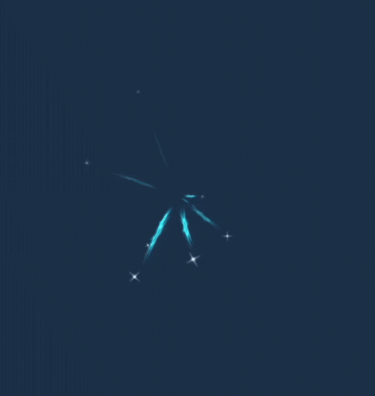

# PLAY: https://jyc021127.github.io/Dirge-of-the-Wolf/

## Table of Contents

* [Evaluation Report](#evaluation-report)
* [Data Collected](#data-collected)
* [Feedback and Changes Made](#feedback-and-changes-made-after-the-evaluation)
* [Shaders and Special Effects](#shaders-and-special-effects)
* [Summary of Contributions](#summary-of-contributions)
* [Other Details](#other-details)
* [References and External Resources](#references-and-external-resources)

**(Please see Milestone 1 submission for Evaluation Plan)**

## Evaluation Report

### Style of Evaluation:
In the past three weeks, we conducted our evaluation in a study room or online zoom meeting with 10* participants. At the same time, by asking each participant to complete the same tasks, these controlled and easily replicated tasks helped us conduct the evaluation more efficiently. Under a tight schedule and limited resources, we had obtained the most accurate results, summarised, and made adjustments to our game.

### Evaluation Mmethodology: 
We applied an observation method (Cooperative evaluation) and Query technique (Semi-structured interview) to conduct evaluation. The observational method is easier for us to make real-time adjustments while the participant is playing the game. Especially, some participants will forget what they were thinking when facing a problem if questions were asked after completing the task. Participants could directly ask questions when encountering difficulties, improving their participation, and we can understand the participants’ thinking processes and decisions.

Additionally, the semi-structured interview helped us understand participants' feelings and experiences, which is better than simple answers to the survey questions. We asked some specific questions regarding different participants through observing their gaming experiences. This method also assists us in finding potential issues or feedback from participants. 

### Participant's Tasks:
We set tasks based on our evaluation goals. Tasks planned to complete:
* Please try to fight against an enemy, and save a wolf spirit.

* Please find and open a chest and acquire a new buff.

* Please defeat the boss in the grassland scene (normal level), do your best, and use all the skills of wolf spirits you acquired in the game to complete this task.
* In the desert scene (Hard level), when you fight with the boss, your blood level should remain above 70% (you can increase your blood through acquiring the chest)
* In the Iceland scene (extreme level), please save more than 10 wolf spirits and defeat the boss to finish the game.

**Interview Questions:**
* What do you think of the game setting and background story?
* Did you find the goal of the game and the control tutorial easy to understand?
* How was your overall gameplay experience?
* What do you think about the difficulties of the maps? (Consider enemy damage and chest arrangements)
* Was the player control smooth and easy to use? (Including player movement, attack control and sensibility)
* What do you think of the scene and audio assets in terms of matching the overall aesthetic?
* Which game mechanic do you find most interesting? Why?
  * AI navigation of bosses and enemies
  * Finding chests and collecting different buffs
  * Using skills on boss
  * Boss fights
  * Defeating enemies and saving spirits
* Did you find wolf spirits obstruct the view?
* Did any part of the game distract you from completing your task?
* What did you find most difficult when completing the tasks?
* Any additional feedback on where the game should be improved?

**Participants**

Four of us contacted our friends, classmates, or siblings, to recruit up to 10 evaluation participants.

Game Frequency: Casual, Frequent, Hardcore

Experience in fighting monster games: Novice, Intermediate, Expert

***Participant demographics***
|No.| Gender | Age | Occupation | Game frequency | Experience of fighting monster games |
| :--- | :--- | :--- | :--- | :--- | :--- |
| P 1 | Male | 20 | Student | Frequent | Intermediate | 
| P 2 | Male | 21 | Student | Hardcore | Intermediate | 
| P 3 | Male | 20 | Student | Casual   | Intermediate | 
| P 4 | Male | 22 | Student | Frequent | Intermediate | 
| P 5 | Male | 22 | Student | Frequent | Intermediate | 
| P 6 | Male | 20 | Student | Frequent | Expert       | 
| P 7 | Female | 23 | Student | Casual | Intermediate | 
| P 8 | Female | 24 | Student | Casual | Expert       | 
| P 9 | Female | 24 | Student | Casual | Intermediate | 
| P10 | Male   | 25 | Student | Casual | Intermediate | 

**Basic target participants:**
* Aged between 20-30 years old;
* gender unlimited;
In order to ensure a broad and rich evaluation, the cultural background and occupation of participants are not considered as criteria; Target participants should be familiar with the English language (refers to English signs or guidance in the game).

**Player Experience:**
* Participants may have limited experience in fighting monster games, but may not be highly skilled players;
* Participants are veteran players who have in-depth knowledge or skill in playing fight monsters games.

**Devices requirements:**
* Participants should be able to use computers or laptops and mouse proficiently
* If conducting evaluation remotely (online), participants are required to have a stable internet connection

### Data collected:
1. Task completion

| Tasks | 1st round evaluation (P1,P2,P3,P4,P5) | 2nd round evaluation (P6,P7,P8,P9,P10) |
| :--- | :--- | :--- |
| Task 1 | All participants finished | All participants finished|
| Task 2 | All participants finished | All participants finished|
| Task 3 | 3 participants failed, 2 participant finished | 2 participants failed, 3 participants finished |
| Task 4 | 1 participant finished | 3 participant finished |
| Task 5 | none participant finished | 3 participant finished |

2. How difficult the player found the task to be

**1 – 2 – 3: Easy — Moderate —- Hard**

**N: Didn’t finish the last task, no chance to experience next game task**
| Tasks | P1 | P2 | P3 | P4 | P5 | P6 | P7 | P8 | P9 | P10 |
| :--- | :--- | :--- | :--- | :--- | :--- | :--- | :--- | :--- | :--- | :--- |
| Task 1 | 1 | 1 | 1 | 1 | 1 | 1 | 1 | 1 | 1 | 1 |
| Task 2 | 1 | 1 | 1 | 1 | 1 | 1 | 1 | 1 | 1 | 1 |
| Task 3 | 3 | 3 | 2 | 2 | 3 | 2 | 3 | 1 | 2 | 3 |
| Task 4 | N | N | N | 2 | 2 | 2 | N | 2 | 3 | N |
| Task 5 | N | N | N | N | 2 | 3 | N | 3 | 3 | N |
| Finished Game | N | N | N | N | N | Y | N | Y | Y | N |

3. How many turns did the player take to complete the task (for example if the task is to kill the boss, how many times did the player die before managing to kill it)

_The task 1 and task 2 are easy for all participants, and they finished in one time. Therefore, we concluded task 3-5._

**N: No win after game**

**Y: The game is over to win**
| Tasks | P1 | P2 | P3 | P4 | P5 | P6 | P7 | P8 | P9 | P10 |
| :--- | :--- | :--- | :--- | :--- | :--- | :--- | :--- | :--- | :--- | :--- |
| Task 3 | 2(N) | 2(N) | 1(N) | 1(Y) | 3(Y) | 1(Y) | 3(N) | 1(Y) | 2(Y) | 3(N) |
| Task 4 | - | - | - | 2(N) | 2(Y) | 2(Y) | - | 2(Y) | 3(Y) | - |
| Task 5 | - | - | - | 2(N) | 3(N) | 2(Y) | - | 2(Y) | 2(Y) | - |

4. Whether the player found it difficult to use/find the controls

Some participants expressed that the game control (mouse) is a little hard to control when they fight with enemies and bosses, and the camera direction does not align with wolf king’s insight. Therefore, we decreased the mouse sensitivity and narrowed the field of view of the lens.

**Collecting the data**
During the offline participants playing the game, one of the group members will use an iPad to record participants’ performance data and audio via mobile phone recording equipment. During the online Zoom evaluation, one of the group members would record the meeting screen, and another would also use an iPad to document participants’ performance data. After each round of evaluation, our group would gather and discuss data to propose the main point of improvement for our game. After refining, we began the second round of evaluation and repeated the above actions to collect valuable data and feedback. Next, according to the advice, we continued to optimize the game.

### Data Analysis:

For **quantitative** data analysis, we focused on the number of participants who managed to complete the tasks assigned, how long they managed to complete them, as well as how many times they failed. By looking at these data, we discussed whether our variables are balanced, making sure that each level is not overly difficult to play.

For **Quantitative** data analysis, interview contexts will be transcribed and user feedback have be examined. We had a comprehensive understanding of the data by analysing graphics and audio effects, game control and user interface, character and story design as well as how our participants think of the game difficulty overall.

#### The metrics used to evaluate our game, and basis for making changes
The game has been evaluated based mainly on the gameplay mechanics and user feedback, this includes the analysis of the number or percentage of players that managed to complete all the tasks. A lower percentage of completion will reflect the level of difficulty of the task and we will need to consider changing the attributes of objects to balance the game difficulty. Based on result of first round evaluation, we found the grassland is a little hard for participants, only one participant in 1st round evaluation could finish task 4. Therefore, we adjusted the game and boss fight mechanism and conducted 2nd round evaluation, the overall game experience was improved and achieved the expected results. 

Additionally, several users find it difficult to use a specific control, then we modify our mouse sensitivity so that the player will be able to play through the tasks without getting stuck at specific spots.

We also focused on looking at what ways players managed to try out in order to solve a problem they face and record the number of times that other participants took out the same action. This helped us assess what guides them to do so and whether these problems are something that distracts them from normal gameplay in reaching the goal.

We also tracked the amount of time the participants took to simply explore the map without opening any chests or killing enemies. A longer basic exploration time suggests that the game will need to be more goal-leading, as the more enemy that the player kills before boss arrives, the higher the chance that player can defeat the boss. 

More details of feedback and changes we made have been summarised in the following section **Feedback and changes made after the Evaluation**

### Timeline:
Our game evaluations were completed at the same time. We have separated the evaluation into multiple rounds, first starts on October 16th and the evaluation rounds will happen after changes have been made according to previous evaluation feedback. This is because not all changes will have a positive effect on our game and we will need to reevaluate them with previous and new participants.

In each round, we interviewed 5 participants and gathered data and user feedback. Then after making improvements according to each round, we will interview new participants to minimize duplication of data and feedback. This also allows us to gather more ideas on how we should improve our overall gameplay.

#### Making changes to the game
Changes have been made after each round of evaluation. Based on the participant feedback, we finalized them in a list of things that we need to improve, looking at what went well and what needs improvement, then trying and fix these problems before the next round of evaluation.

### Responsibilities:
#### Who is responsible for each task?
Two members formed a group (two groups) to evaluate the game with each participant. One takes the role of the host and the other as the writer.

The host introduced the game and tasks, asking questions during gameplay and giving hints where possible, and also letting the participants know that no personal information will be needed, and data collected will only be used for the purpose of evaluation.

The writer’s job is to observe the player, record the actions that the player took and things that they said, as well as noting down the time it took for the participant to complete a specific task.

Finally, all team members analyzed the data from the participants and made adjustments to the game according to the feedback.

#### How will you ensure that everyone contributes equally?
Since it’s minimum of 10 participants is needed for the evaluation, each team member found at least 2-3 participants. We will also make sure that each group of 2 team members will switch roles from time to time. To ensure equal contribution, everyone worked together to analyse the data collected at each evaluation round.

### Feedback and changes made after the Evaluation
|Area to improve|Feedback|What we have done|
|:----|:----|:----|
|Map|Map is too large, it’s easy to get lost|Adjusted map size from 1000x1000 to 500x500|
|Player|Camera is wobbly, and player gets dizzy because camera rotation is way too flexible|Smoothed uneven areas in the terrain, slightly adjusted camera control so that it will not be rotated directly at wolf’s eye view|
| |Large number of wolf spirits obstruct the view, maybe make their trails shorter|Redesigned wolf spirit mechanic. Wolf spirits collected will no longer all orbit next to wolf and attack boss when they get close. Player will start with 3 orbiting spirits, all other spirits collected will be shown in the skill UI for the player to during boss fight|
| |Change player’s health bar to show %|Not implemented because there are too many UIs at the bottom of the screen and it’s more direct to see the health bar moving|
| |Player controll is a bit difficult, hard to face enemy|Player can now lock it's facing by holding on down the right mouse|
| |Dodge cooldown is too long, and player won’t know when they can dodge again|Added cooldown UI for dodge, player can see exactly when dodge can be used|
| |It’s hard to attack if player can only cause damage to enemies directly infront of it, player control is quite difficult|Widened player’s attack range so that player can still reach enemies that aren’t directly infront of it|
| |“A bit boring where player simply just do normal attack, maybe can add some long distance attack”|Implemented skills for the player, including healing, stun, and long distance attack with different sound effects|
|Boss|It’s difficult to find boss when it arrives given the map size|Added an arrow pointing to the boss when it arrives, arrow will disappear once player is close enough|
| |Boss’s damage is a bit too high, really easy to fail the game|Adjusted boss and enemies damage, making sure that player can defeat the boss within the given time range|
|Enemies|Player won’t know if they actually caused damage on enemies until enemy dies|Added attack sound effects, blood particle, and health bar for enemies|
|Chest|Health chest’s recover value is too low, it’s quite easy to die, try double the amount|Added more health chests in the map and also changed recover value from 200 to 500|
| |Not very easy to see where the chests are |Added bonfires with corresponding colours next to the chests in all maps|
|UI|Game mechanic is a bit difficult to understand in instructions|Redesigned game mechanic page, made sure that player can understand all functions|
| |Don’t use the same BGM throughout the whole game|Added BGMs for victory and defeat conditions|

> _Wolf spirits improvement example_
> 
> _Before and After_

   
   

## Shaders and Special Effects
### Water Shader: 
**https://github.com/COMP30019/project-2-mihoyo/blob/main/Assets/Assessed%20Shaders/NewUnlitShader.shader**
> _Water Shader_

   

The dynamic effect of water waves is rendered by the DesertWater shader given Ripple noise. By observing the effect of fluctuating water surface, the properties of water and ripple were added to the shader, and later through continuous refinement, it was decided that three properties would be used in _Water and 6 properties would be used in _Ripple. _WaterSpeed will be used to control water speed, and xy and zw control the waterspeed in different directions respectively. _WaterColor property allows us to adjust the water color through the inspector board, _WaterNoise is a noise texture, which simulate water ripple. Additionally, _RippleColor, _RippleSpeed, _RippleDepth, _RippleSize，_RippleArti could be used to adjust ripple color, ripple speed, ripple depth, ripple size and ripple articulation. The range is used for _RippleTrans to visualize ripple transparency and select appropriate value.

In the "fragg" function, we define a float4 variable col to receive the WaterColor from the property. Then defined float  finalNoise0 and float finalNoise1 respectively to receive the results of the first layer sampled texture and the second layer sampled texture. Next, Defined a directional UV coordinate, uv0, for texture sampling. Then, by multiplying the built-in time variable _Time.x with _WaterSpeed in Unity shader, a time-based offset is created. Next, by multiplying the uv0 coordinates with _RippleSize and achieve the tiling effect. These two components can be added together to obtain uv0 that moves and changes dynamically according to the time offset. We could obtain the sampled uv of noise pattern with time for simulating water ripple Next, also defined a uv1, same as before, the difference is that the components of _WaterSpeedhave been changed, to simulate ripples in different directions and speeds.

Next, we sampled two noise textures, where used tex2D function. The first parameter stores _WaterNoise, the second parameter is uv0 and uv1 which we calculated above. It is worth noting that uv1 is multiplied by 1.3 here in order to make the water wave presented more natural, and this value is finally found that the effect of 1.3 is better through continuous adjust. After getting the finalNoise0 and finalNoise1, we need to define a float LastNoise that save the result of multiplying two values.  Because the interval of two (sampled two noise textures) results is between (0,1), then we can get a "convective" area by multiplying. Next, using step function to determine and use _RippleArti as a threshold to control which parts of the noise can generate visible water ripples, and multiply the output of step and _RippleTrans, so as to control the visibility of water ripples and narrow the range of water ripple to (0,1), 0 represents the water surface and 1 represents the region of the water ripples.

Finally, we used lerp function to make ripple area darker or brighter, simulating the interaction of light with the water surface. Because the range obtained from the previous calculation is (0,1), so 0 will show col and 1 will show ripple color. we finally find the most realistic water wave rendering effect in the desert by adjusting the parameters on the inspector board.

### Dissolve Shader: 
**https://github.com/COMP30019/project-2-mihoyo/blob/main/Assets/Assessed%20Shaders/EnemyDeath.shader**
* C# Script for controlling properties of the shader: https://github.com/COMP30019/project-2-mihoyo/blob/main/Assets/Chests/Scripts/DissolveUpdate.cs
> _Dissolve Shader_

   

The dissolve shader’s purpose is to dissolve an object over time given a ‘noise’ texture. In order to achieve this, both shader and C# code are combined. For the shader, three properties are added. The _DissolveTex will be the texture that’s used for the dissolve effect clipping, it contains a greyscale value that controls how dissolved the main (object’s) texture is, it will start gradually dissolve from where the darkest area of the _DissolveTex is towards the lightest. The _DissolveThreshold is the actual value that we will be modifying with C# code, this value is set to have a range between 0 to 1, it will help control the level of transparency at which pixels will be clipped. The _Color property is a uniform parameter, we can select the color in the inspector panel for the edge where the texture’s been dissolved.

In the ‘frag’ function, the ‘dissolve’ parameter is set as the _DissolveTex that we selected for clipping (in inspector) with original transparency . ‘dx’ and ‘dy’ is calculated by subtracting areas of the _DissolveTex with transparency * 0.4 by normal transparency of the texture, this is used to obtain the pixel areas where the transparency of the _DissolveTex is decreased (but not completely clipped). ‘dx’ and ‘dy’ are set with the same equation because both x and y directions are considered (symmetrically) to calculate the distance between the current pixel and the pixel that has a transparency of original * 0.4. 

The distance specifically is calculated with the next line of code “edge = sqrt(dx * dx + dy * dy)”, which will be where the edge is. The reason that 0.4 is used is because if a smaller value is used, the transparency difference will be too small, hence resulting in not being able to see the edge very clearly. Then this distance value “edge” will be compared with the _DissolveThreshold, if it is less than the _DissolveThreshold, meaning that the pixel is close to the edge of the dissolve effect that’s within the threshold distance, then the function lerp is used to perform a linear interpolation of the object color with the chosen color. The edge parameter in this function is multiplied by 4 for an amplified effect, creating a brighter color effect.

The clip function is used for the actual dissolving effect, it compares the uv coordinates of the dissolve texture with the dissolve threshold, if the the current level of transparency of the texture is less than the dissolve threshold, then the pixels in those areas will no longer be rendered, creating a dissolve effect.

By combining the edge detecting function with the texture clipping, as well as modifying the _DissolveThreshold overtime when Update() function is called in the C# script, we are able to achieve a dissolve effect with a colored edge.

### Particle system (shooting star inside the prefab): 
**https://github.com/COMP30019/project-2-mihoyo/blob/main/Assets/CharacterPrefabs/Prefabs/Characters/Player/MegicMissle.prefab**
> _Missile in use_

   

This particle effect is a magic missile fired by the player at the boss, activated by pressing the 'F' key. It's likely the most intricate particle effect in the entire game. Let me walk you through the creation process, from the initial design to the final implementation and detail refinement.

Understanding that this missile is a key attack mechanism against the boss and drawing inspiration from the game's backstory, where the missiles are crafted from the souls of the protagonist's deceased comrades, I chose a bright blue color for its design. The shape was less complex to decide upon - a standard spherical form with a trailing effect, typical of magic missiles, seemed apt, so I didn't experiment much there.

The development process began with setting up a particle system component, deactivating the Emission, Shape, and Render tabs. Beneath this particle system, I created a child object with its own particle system to generate the main effect of the missile - the core sphere. The parent particle system component was primarily for easy previewing; it enabled a holistic view of all child particle effects in a single selection. If the parent didn't have its own particle system, the child effects wouldn't be as easily visible.

Moving to the core of the missile, since no existing materials seemed fitting, I crafted a new one, opting for a Legacy Shaders/Particles/Additive shader. I chose a texture resembling a missile for this new material. Once I dragged this material into the main Render Material slot for the missile's body, I started fine-tuning the Shape and Emission settings. I disabled the Shape feature and reduced the Start Speed to zero, transforming it into a stationary sphere. This simplicity felt somewhat bland, so I introduced dynamics by enabling Size Over Lifetime and Color Over Lifetime, and tweaking the corresponding curves. This made the sphere pulsate and vary in size, adding vitality. A rotational movement was also added to enhance its liveliness.
> _the main missile particle_

   

Despite these additions, something still felt lacking. Then I had the idea to use small, dispersing star particles to represent the holy soul fragments of the wolf comrades, thereby adding depth and richness to the missile's appearance. I placed a new particle system beneath the sphere, assigned it a small cross-star material, and set the shape to a sphere so the stars would scatter outward. Similar to the main sphere, I adjusted the star particles' color and size over time, incorporating rotational and trailing effects, which made the star system look striking.

> _the star particle_

   

To complete the design, I added a green trailing effect to the overall structure, achieving the final, vibrant appearance of the missile.

## Summary of Contributions
### Chi Wang
Created desert scene, developed enemy spawning script, added chests and corresponding buffs scripts, audio management, player dust trail, dissolved shader, storing/updating game progress, and implemented UIs in the game including buttons, page switching, skill, dodge and buff countdowns, as well as victory/defeat management.

Code contributions:
* https://github.com/COMP30019/project-2-mihoyo/blob/main/Assets/Characters/Monsters/enemySpawn.cs
* https://github.com/COMP30019/project-2-mihoyo/blob/main/Assets/Characters/Player/Scripts/PlayerAudio.cs
* https://github.com/COMP30019/project-2-mihoyo/tree/main/Assets/Chests/Scripts
* https://github.com/COMP30019/project-2-mihoyo/tree/main/Assets/UI/UI%20script/CharacterUI
* https://github.com/COMP30019/project-2-mihoyo/blob/main/Assets/Assessed%20Shaders/EnemyDeath.shader

(below are partial contributions)
* https://github.com/COMP30019/project-2-mihoyo/blob/main/Assets/Characters/AnimalScript/Animals.cs
* https://github.com/COMP30019/project-2-mihoyo/blob/main/Assets/Characters/Player/Scripts/PlayerController.cs
* https://github.com/COMP30019/project-2-mihoyo/blob/main/Assets/Characters/Player/Scripts/WeaponCollider.cs
* https://github.com/COMP30019/project-2-mihoyo/blob/main/Assets/UI/UI%20script/SceneUI/UIManager.cs

### Jiaan Li
I was mainly responsible for the UI design of the entire game as well as the construction of two scenarios, so I did more work on the artwork side of things. Creating Grassland scene and iceland scene, design most of UI elements (include icons, buttons, interfaces, pop up) and page jump Settings codes. Add snow particle effect in the iceland scene and bonfires particle effect in the grassland. 

Because I found that when I “Pull” our program to Github through my laptop would cause a lot of code to be lost, therefore I reduced the “Pull” times later and transfer design materials or codes to my team member Chi Wang and let her to pull program instead of me to avoid content loss.

Code contributions:
* https://github.com/COMP30019/project-2-mihoyo/blob/main/Assets/Assessed%20Shaders/NewUnlitShader.shader
* https://github.com/COMP30019/project-2-mihoyo/blob/main/Assets/UI/UI%20script/SceneUI/UIManager.cs
* https://github.com/COMP30019/project-2-mihoyo/blob/main/Assets/UI/UI%20script/SceneUI/scenemove.cs

(below are partial contributions)
* https://github.com/COMP30019/project-2-mihoyo/blob/main/Assets/Characters/Player/Scripts/PlayerAudio.cs

### Zihan Liu
Configured animation controllers for all characters appearing in the game. Developed scripts for character controller, camera controller, weapon collision, magic missile launching, and arrow to boss mechanics. Implemented numerous particle systems including those for magic missiles, healing auras, stun and knockdown effects, particle systems on the weapons of the third level's boss, particle systems above the heads of minions in the third level, bleeding effects for all characters when hit, and trailing effects for weapons during attacks.

Code contributions:
* https://github.com/COMP30019/project-2-mihoyo/blob/main/Assets/Characters/Player/Scripts/PlayerController.cs
* https://github.com/COMP30019/project-2-mihoyo/blob/main/Assets/Characters/Player/Scripts/CameraController.cs
* https://github.com/COMP30019/project-2-mihoyo/blob/main/Assets/Characters/Player/Scripts/WeaponCollider.cs
* https://github.com/COMP30019/project-2-mihoyo/blob/main/Assets/Characters/Player/Scripts/SpritMissle.cs
* https://github.com/COMP30019/project-2-mihoyo/blob/main/Assets/Characters/Player/Scripts/ArrowToBoss.cs
  
(below are partial contributions)
* https://github.com/COMP30019/project-2-mihoyo/blob/main/Assets/Characters/Boss/Gloem/Scripts/BossController.cs
* https://github.com/COMP30019/project-2-mihoyo/blob/main/Assets/Characters/Monsters/Specter/Scripts/MonsterController.cs

### ZiRui Zhao
I've developed the foundational parent class for all biological entities in the game. Additionally, I've crafted controllers for all hostile entities, as well as the script for the Wolf Spirit character. My responsibilities also encompass thoroughly investigating and resolving various bugs, conducting comprehensive game testing, and ensuring that all in-game values and mechanics are balanced effectively. To mitigate any issues, I've opted to perform pulls infrequently, as my laptop tends to encounter problems during this process as Jiaan has when I push. Instead, I've been utilizing ZiHan's laptop for this purpose.

Code contributions:
* https://github.com/COMP30019/project-2-mihoyo/blob/main/Assets/Characters/Player/WolfSprit.cs
* https://github.com/COMP30019/project-2-mihoyo/blob/main/Assets/Characters/Boss/Gloem/Scripts/BossController.cs
* https://github.com/COMP30019/project-2-mihoyo/blob/main/Assets/Characters/Monsters/Specter/Scripts/MonsterController.cs
* https://github.com/COMP30019/project-2-mihoyo/blob/main/Assets/Characters/AnimalScript/Animals.cs
* https://github.com/COMP30019/project-2-mihoyo/blob/main/Assets/Characters/AnimalScript/Steering.cs

(below are partial contributions)
* https://github.com/COMP30019/project-2-mihoyo/blob/main/Assets/Characters/Player/Scripts/PlayerController.cs
* https://github.com/COMP30019/project-2-mihoyo/blob/main/Assets/Characters/Player/Scripts/CameraController.cs

## Other Details
One of the main technical challenges we faced was unintended deletion of files, this happened to two of our team members where the same set of files such as BGM and textures always gets deleted unintentionally, resulting in many bugs. Looking at the deleted file, the name ends with ‘.icloud’ so we assume that it’s a problem with Mac deleting it’s iCloud files. Unfortunately, we could not find a fix, so those team members had to create UI or scripts individually and get others to help them push to Git Hub.

A graphical challenge we faced was using the dissolve shader on chests, when the shader was added to the material, and parameters are changed, the dissolve effect can be seen directly in the inspector panel, however, the object in the game scene did not change. After putting the material on a newly created cube, the dissolve effect is working again. We realised that the chest is composed of a roof and a body child with separate materials, this issue is solved by applying the shader material to both roof and the body (rather than just their parent).

## References and External Resources
#### Assets
* https://assetstore.unity.com/packages/3d/environments/landscapes/low-poly-simple-nature-pack-162153
* https://assetstore.unity.com/packages/2d/fonts/fatality-fps-gaming-font-216954
* https://assetstore.unity.com/packages/3d/props/3d-low-poly-chest-240360
* https://assetstore.unity.com/packages/3d/environments/landscapes/simple-low-poly-nature-pack-157552
* https://assetstore.unity.com/packages/3d/environments/landscapes/polydesert-107196
* https://assetstore.unity.com/packages/vfx/particles/legacy-particle-pack-73777#content
* https://assetstore.unity.com/packages/3d/characters/animals/poly-art-wolf-78795
* https://assetstore.unity.com/packages/3d/characters/humanoids/fantasy/polygon-fantasy-rivals-low-poly-3d-art-by-synty-118399
* https://assetstore.unity.com/packages/3d/environments/dungeons/polygon-dungeon-realms-low-poly-3d-art-by-synty-189093
* https://assetstore.unity.com/packages/3d/animations/giant-golem-animset-176573
* https://assetstore.unity.com/packages/3d/animations/2handed-hammer-animset-154725
* https://assetstore.unity.com/packages/3d/animations/grim-reaper-animset-147220
* https://assetstore.unity.com/packages/3d/environments/landscapes/lowpoly-style-winter-environment-90758
* https://assetstore.unity.com/packages/3d/vegetation/trees/low-poly-tree-pack-57866
* https://assetstore.unity.com/packages/2d/textures-materials/sky/customizable-skybox-174576
* https://assetstore.unity.com/packages/3d/environments/landscapes/simple-low-poly-nature-pack-157552

#### BGM and Sound Effects
* https://taira-komori.jpn.org/nature01en.html
* https://mixkit.co/free-sound-effects/spell/
* https://mixkit.co/free-sound-effects/run/
* https://pixabay.com/sound-effects/cartoon-spin-7120/
* https://taira-komori.jpn.org/openclose01cn.html
* https://www.aigei.com/sound/class/
* https://artlist.io/sfx/categories/gaming?utm_source=google&utm_medium=cpc&utm_campaign=17432246070&utm_content=143196716331&utm_term=&keyword=&ad=650184911166&matchtype=&device=c&gad_source=1&gclid=Cj0KCQjwy4KqBhD0ARIsAEbCt6jHoWYvnKciKgHyehfgdRPEUnCHDGKRoR8IYcErvFYvoBBXBFANc5YaAoLLEALw_wcB

#### Code References
* https://www.cnblogs.com/Akishimo/p/5057542.html
* https://cloud.tencent.com/developer/article/2086229
* https://www.shadertoy.com/view/td2yDm
* https://gooning.wordpress.com/2017/04/07/bezier-curves-for-your-games-a-tutorial/
* https://blog.csdn.net/w9503/article/details/105322873?ops_request_misc=&request_id=&biz_id=102&utm_term=%E6%B0%B4%E6%B3%A2%20shader&utm_medium=distribute.pc_search_result.none-task-blog-2~all~sobaiduweb~default-8-105322873.142^v96^pc_search_result_base5&spm=1018.2226.3001.4187

